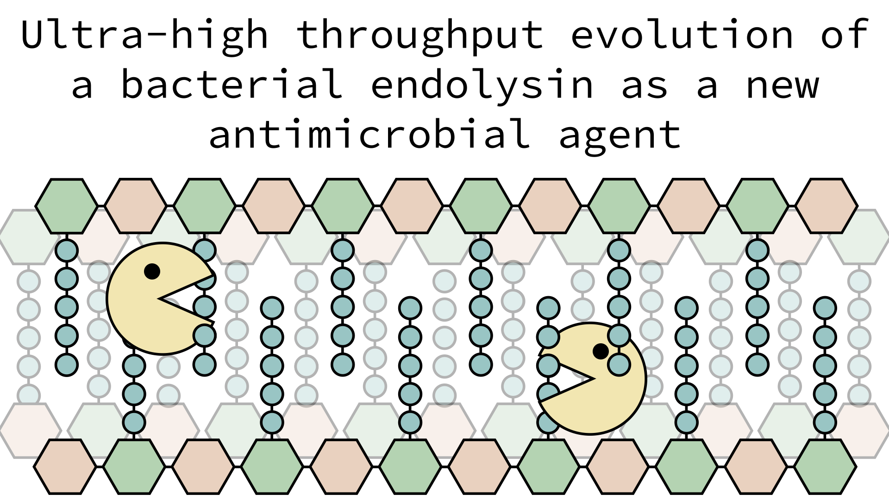

{ width=1000px }

QPeptidoglycan consists of N-acetylglucosamine and N-acetylmuramic acid chains interlinked by short peptides. These peptides – specific by class of bacteria – are targeted by autolysins, enzymes with an important role in bacterial cell growth and duplication that act by remodeling and relaxing the peptidoglycan structure. Given the increasing threat posed by antibiotic resistance and the demand of new antimicrobial agents, we decided to explore whether it is possible to improve the proteolytic properties of an autolysin.
With our project, we aim to perform rounds of directed evolution on the autolysin SagA to make it suitable to act as an endolysin against the well-known pathogen Staphylococcus aureus. Using the aid of the powerful tool of droplet microfluidic, libraries of SagA will be screened for increased activity against a model fluorogenic peptide, and the final product of evolution will be then used to perform in vivo assays to assess the new activity.

