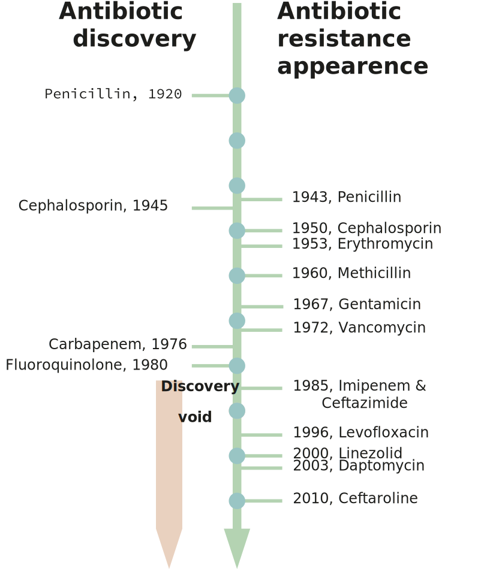

# **Background**

## A Brief History of Antibiotic Resistance

The threat of bacterial infection is as long as humanity itself. A terrifying and often mythicized example is the bubonic plague that devastated Europe and Asia in the mid 1300s; only in the age of modern genetics it was found that the disease is caused by the bacteria *Yersinia pestis*' infection (Demeure et al, 2019). *Y. pestis* is only one of tens of bacterial species pathogenic to humans. With the discovery of penicillin, the golden age of antibiotics began (Chain et al., 2005) and in 1945 penicillin was already mass-produced. From 1950s to the '70s, most of the antibiotic classes today known were discovered (Zaman et al., 2017). During this time antibiotics were regarded as the perfect answer to bacterial infections: they were safe and effective.
However, the unregulated use of antibiotics eventually led to the emergence of resistant bacterial strains (Fig 1.) (Aminov, 2010). The level of antibiotic-resistant infections was found to be strongly correlated with the degree of antibiotic consumption (Goossens et al., 2005). Bacteria develop antibiotic resistance using various mechanisms: hydrolysis, efflux, altered target, chemical modification (Zaman et al., 2017). United States’ Centers for Disease Control and Prevention estimate that in the US more than 35000 people die each year of antibiotic resistant infections, and the estimated cost of treatment of multi-drug resistant pathogens in US is estimated $4.6 billion (Nelson et al., 2021). 
As fewer new antibiotics are commercialised and multidrug resistance develops, new antibacterial agents are necessary.

{ width=600px }

Figure 1. Graphical representation of discovery of antibiotic versus time to discover antibiotic resistance. The red arrow (lower direction) indicates the discovery void and increased antibiotic resistance (Adapted from Zaman et al., 2017).

## Resistance Wars: A New Hope

As fewer new antibiotics are commercialised and multidrug resistance develops, new antibacterial agents are necessary. As conventional antibiotics proved to be unreliable, attention was drawn to bacteriophages and their lytic enzymes, and phage therapy is gaining a second wind in modern medicine. Even though phage therapy is still in it's infancy, trials conducted so far have reported no adverse effects concerning the use of phages, confirming previous observations in mice (Melo et al., 2020). Usage of phages may pose other threat - as bacteria are prone to develop antiviral resistance (Gao Linyi et al., 2020; Koonin et al., 2017). To tackle the problem of bacterial infection, different strategies have to be employed. An alternative to phage therapy is using a phage lytic enzyme that is usually is further engineered. Such enzymes possess bacterial cell wall-degrading activity and are used by phages to escape the cell (Vázquez et al., 2018).

## A-(D-iN)-K-(D-A)-(D-A): Just Another Brick In The Wall

Peptidoglycan is the main component of bacterial cell wall (Fig 2).; it consists of a sugar backbone chain interlinked by short peptides. While the sugar backbone is universal for all bacteria, its structure and interlinking peptides varies depending on bacteria taxon (Schleifer and Kandler, 1972). Phage lytic enzymes – endolysins – targeting PG sugars have been shown to reduce bacteria growth in vitro and in vivo, and their use as antimicrobial agents has advanced to the stage of clinical trials (Abdelkader et al., 2019; Vermassen et al., 2019).  Most enzymes under development to this purpose target the sugar backbone of PG, while those targeting PG interlinking peptides have been overlooked (Vermassen et al., 2019). Development of antimicrobial enzymes with endopeptidase activity could broaden the arsenal of know enzymatic antibacterial agents; such peptidase could be developed to target a specific range of bacteria by targeting a specific peptide. In addition, peptidoglycan-associated peptides contain D-amino acids, which are not present in mammalian proteins. Therefore, targeting D-L peptides may contribute to safe use in animals. Large part of phage lysins in nature are modular – displaying multiple domains with different functions (Vermassen et al., 2019). By combining modules with different enzymatic and peptidoglycan binding activities new desired antibacterial agents can be developed (Gerstmans et al., 2020).

{ width=400px }

Figure 2. Structure of *S. aureus* peptidoglycan.

## X-zymes: targets for mutagenesis and evolution

Proteins from the NlpC/P60 family were selected as the target for evolution. These proteins, referd as autolysins, participate in cell growth by relaxing peptidoglycan, necessary to allow cell growth and division (Typas et al., 2012), and they usually harbour aditional domains. SagA use coiled coil domain for localization at cell division terminus (Espinosa et al., 2020; Hyun et al., 2021), while three LysM-domain repeats in LytE ensure affinity ro peptidoglycan (Visweswaran et al., 2014).
The goal of this project is to evolve only the NlpC/p60 domain either as s stand-alone protein or fused to native peptidoglycan binding domain. The NlpC/P60 domain is a papain-like cysteine peptidase domain approximately 100 amino acids long (Anantharaman and Aravind, 2003). These endopeptidases are involved in the cleavage of the N-acetylmuramate-L-alanine or D-γ-glutamyl-mesodiaminopimelate (Ohnishi et al., 1999).

The selection of the NlpC/P60 peptidase family was driven for three main reasons:

* Potential to be evolved to act as efficient peptidoglycan lysis enzymes;
* Specificity to peptidoglycan DL-peptides;
* Small size of NlpC/P60 domain, appealing for use in medicine and biotechnology.

We selected two putative autolysins: SagA from *Enterococcus faecium* and LytE from *Bacillus subtilis*. We also decided to use the standalone NlpC/P60 domains of SagA and LytE. With our project, we aim to perform evolution on the autolysin to make it suitable to act as an endolysin against *S. aureus*.

{ width=1000px }
Figure 3. A) Alphafold2 model of SagA protein. NlpC/P60 domain is yellow, coiled-coil – purple. Protein is also rich in unstructured loops, which are colored in grey. B) Alphafold2 model of LytE protein. NlpC/P60 domain is yellow, LysM repeats are green. C) Crystal structure of SagA NlpC/P602 domain, PDB ID: 6B8C. D) Alphafold2 model of LytE NlpC/P60 domain.

# **References**
Abdelkader, K., Gerstmans, H., Saafan, A., Dishisha, T., and Briers, Y. (2019). The Preclinical and Clinical Progress of Bacteriophages and Their Lytic Enzymes: The Parts are Easier than the Whole. Viruses 11, 96.
 
 
Aminov, R.I. (2010). A Brief History of the Antibiotic Era: Lessons Learned and Challenges for the Future. Front. Microbio. 1.
 
 
Anantharaman, V., and Aravind, L. (2003). Evolutionary history, structural features and biochemical diversity of the NlpC/P60 superfamily of enzymes. Genome Biology 12.
 
 
Chain, E., Florey, H.W., Gardner, A.D., Heatley, N.G., Jennings, M.A., Orr-Ewing, J., Sanders, A.G., and Peltier, L.F. (2005). THE CLASSIC: Penicillin as a Chemotherapeutic Agent: Clinical Orthopaedics and Related Research 439, 23–26.
 
 
Demeure, C.E., Dussurget, O., Mas Fiol, G., Le Guern, A.-S., Savin, C., and Pizarro-Cerdá, J. (2019). Yersinia pestis and plague: an updated view on evolution, virulence determinants, immune subversion, vaccination, and diagnostics. Genes Immun 20, 357–370.
 
 
Espinosa, J., Lin, T.-Y., Estrella, Y., Kim, B., Molina, H., and Hang, H.C. (2020). Enterococcus NlpC/p60 Peptidoglycan Hydrolase SagA Localizes to Sites of Cell Division and Requires Only a Catalytic Dyad for Protease Activity. Biochemistry 59, 4470–4480.
 
 
Gerstmans, H., Grimon, D., Gutiérrez, D., Lood, C., Rodríguez, A., van Noort, V., Lammertyn, J., Lavigne, R., and Briers, Y. (2020). A VersaTile-driven platform for rapid hit-to-lead development of engineered lysins. Sci. Adv. 6, eaaz1136.
 
 
Goossens, H., Ferech, M., Stichele, R.V., and Elseviers, M. (2005). Outpatient antibiotic use in Europe and association with resistance: a cross-national database study. 365, 9.
 
 
Hyun, Y., Baek, Y., Lee, C., Ki, N., Ahn, J., Ryu, S., and Ha, N.-C. (2021). Structure and Function of the Autolysin SagA in the Type IV Secretion System of Brucella abortus. Mol.Cells 44, 517–528.
 
 
Melo, L.D.R., Oliveira, H., Pires, D.P., Dabrowska, K., and Azeredo, J. (2020). Phage therapy efficacy: a review of the last 10 years of preclinical studies. Critical Reviews in Microbiology 46, 78–99.
 
 
Nelson, R.E., Hatfield, K.M., Wolford, H., Samore, M.H., Scott, R.D., Reddy, S.C., Olubajo, B., Paul, P., Jernigan, J.A., and Baggs, J. (2021). National Estimates of Healthcare Costs Associated With Multidrug-Resistant Bacterial Infections Among Hospitalized Patients in the United States. Clinical Infectious Diseases 72, S17–S26.
 
 
Ohnishi, R., Ishikawa, S., and Sekiguchi, J. (1999). Peptidoglycan Hydrolase LytF Plays a Role in Cell Separation with CwlF during Vegetative Growth of Bacillus subtilis. J Bacteriol 181, 3178–3184.
 
 
Schleifer, K.H., and Kandler, O. (1972). Peptidoglycan. Types of Bacterial Cell Walls and their Taxonomic Implications. BACTERIOL. REV. 36, 71.
 
 
Typas, A., Banzhaf, M., Gross, C.A., and Vollmer, W. (2012). From the regulation of peptidoglycan synthesis to bacterial growth and morphology. Nat Rev Microbiol 10, 123–136.
 
 
Vázquez, R., García, E., and García, P. (2018). Phage Lysins for Fighting Bacterial Respiratory Infections: A New Generation of Antimicrobials. Front. Immunol. 9, 2252.
 
 
Vermassen, A., Leroy, S., Talon, R., Provot, C., Popowska, M., and Desvaux, M. (2019). Cell Wall Hydrolases in Bacteria: Insight on the Diversity of Cell Wall Amidases, Glycosidases and Peptidases Toward Peptidoglycan. Front. Microbiol. 10, 331.
 
 
Visweswaran, G.R.R., Leenhouts, K., van Roosmalen, M., Kok, J., and Buist, G. (2014). Exploiting the peptidoglycan-binding motif, LysM, for medical and industrial applications. Appl Microbiol Biotechnol.
 
 
Zaman, S.B., Hussain, M.A., Nye, R., Mehta, V., Mamun, K.T., and Hossain, N. (2017). A Review on Antibiotic Resistance: Alarm Bells are Ringing. Cureus.

