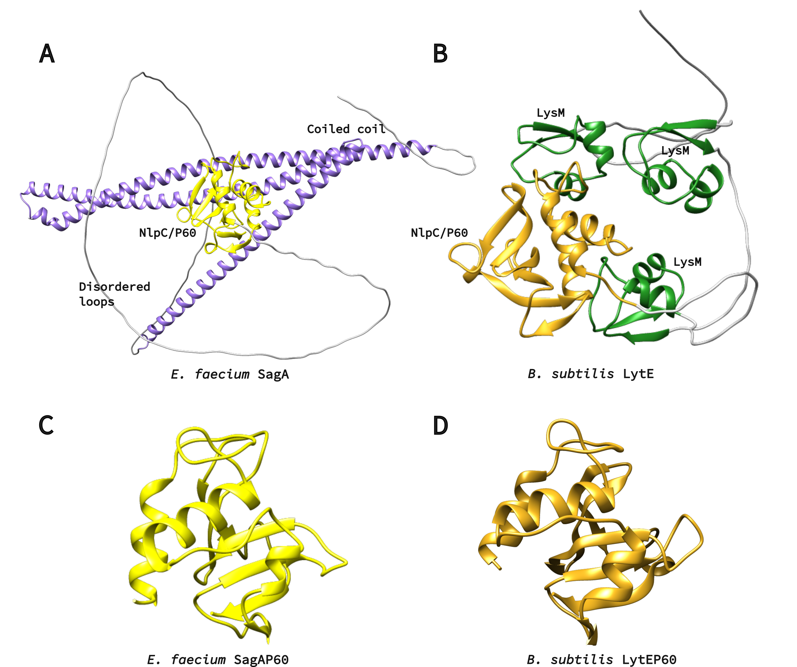

# **Background**

## A Brief History of Antibiotic Resistance

The threat of bacterial infection is as long as humanity itself. A terrifying and often mythicized example is the bubonic plague that devastated Europe and Asia in the mid 1300s; only in the age of modern genetics it was found that the disease is caused by the bacteria *Yersinia pestis*' infection (Demeure et al, 2019). *Y. pestis* is only one of tens of bacterial species pathogenic to humans. With the discovery of penicillin, the golden age of antibiotics began (Chain et al., 2005) and in 1945 penicillin was already mass-produced. From 1950s to the '70s, most of the antibiotic classes today known were discovered (Zaman et al., 2017). During this time antibiotics were regarded as the perfect answer to bacterial infections: they were safe and effective.
However, the unregulated use of antibiotics eventually led to the emergence of resistant bacterial strains (Aminov, 2010). The level of antibiotic-resistant infections was found to be strongly correlated with the degree of antibiotic consumption (Goossens et al., 2005). Bacteria develop antibiotic resistance using various mechanisms: hydrolysis, efflux, altered target, chemical modification (Zaman et al., 2017). United States’ Centers for Disease Control and Prevention estimate that in the US more than 35000 people die each year of antibiotic resistant infections, and the estimated cost of treatment of multi-drug resistant pathogens in US is estimated $4.6 billion (Nelson et al., 2021). 
As fewer new antibiotics are commercialised and multidrug resistance develops, new antibacterial agents are necessary.

Figure 1. Graphical representation of discovery of antibiotic versus time to discover antibiotic resistance. History of antibiotic discovery (green arrow) and time of first reported year of antibiotic resistance (right side). The red arrow (lower direction) indicates the discovery void and increased antibiotic resistance (Adapted from Zaman et al., 2017).

## Resistance Wars: A New Hope

As fewer new antibiotics are commercialised and multidrug resistance develops, new antibacterial agents are necessary. As conventional antibiotics proved to be unreliable, attention was drawn to bacteriophages and their lytic enzymes, and phage therapy is gaining a second wind in Western medicine. Even though phage therapy is still in it's infancy, trials conducted so far have reported no adverse effects concerning the use of phages, confirming previous observations in mice (Melo et al., 2020). Usage of phages may pose other threat - as bacteria are prone to develop antiviral resistance (Gao Linyi et al., 2020; Koonin et al., 2017). To tackle the problem of bacterial infection, different strategies have to be employed. An alternative to phage therapy is using a phage lytic enzyme that is usually is further engineered. Such enzymes possess bacterial cell wall-degrading activity and are used by phages to escape the cell (Vázquez et al., 2018).

## A-(D-iN)-K-(D-A)-(D-A): Just Another Brick In The Wall

Peptidoglycan is the main component of bacterial cell wall; it consists of a sugar backbone chain interlinked by short peptides. While the sugar backbone is universal for all bacteria, its structure and interlinking peptides varies depending on bacteria taxon (Schleifer and Kandler, 1972). Phage lytic enzymes – endolysins – targeting PG sugars have been shown to reduce bacteria growth in vitro and in vivo, and their use as antimicrobial agents has advanced to the stage of clinical trials (Abdelkader et al., 2019; Vermassen et al., 2019).  Most enzymes under development to this purpose target the sugar backbone of PG, while those targeting PG interlinking peptides have been overlooked (Vermassen et al., 2019). Development of antimicrobial enzymes with endopeptidase activity could broaden the arsenal of know enzymatic antibacterial agents; such peptidase could be developed to target a specific range of bacteria by targeting a specific peptide. In addition, peptidoglycan-associated peptides contain D-amino acids, which are not present in mammalian proteins. Therefore, targeting D-L peptides may contribute to safe use in animals. Large part of phage lysins in nature are modular – displaying multiple domains with different functions (Vermassen et al., 2019). By combining modules with different enzymatic and peptidoglycan binding activities new desired antibacterial agents can be developed (Gerstmans et al., 2020).

{ width=400px }

Figure 2. Structure of *S. aureus* peptidoglycan.

## X-zymes: targets for evolution

Proteins from the NlpC/P60 family were selected as the target for evolution; these proteins participate in cell growth by relaxing peptidoglycan (Typas et al., 2012) to allow cell growth and division, and they usually harbor multiple peptidoglycan-binding domains. SagA has a coiled coil domain (Espinosa et al., 2020; Hyun et al., 2021) and LytE has three LysM  domain repeats (Visweswaran et al., 2014).
The goal of this project is to evolve only the NlpC/p60 domain either as s stand-alone protein or fused to native peptidoglycan binding domain. The NlpC/P60 domain is a papain-like cysteine peptidase domain approximately 100 amino acids long (Anantharaman and Aravind, 2003). These endopeptidases are involved in the cleavage of the N-acetylmuramate-L-alanine or D-γ-glutamyl-mesodiaminopimelate (Ohnishi et al., 1999).

The selection of the NlpC/P60 peptidase family was driven for three main reasons:

* Posibility to be evolved to act as efficient peptidoglycan lysis enzymes;
* Specificity to peptodoglycan peptides;
* Small size of NlpC/P60 domain, appealing for use in medicine and biotechnology.

We selected two putative proteins: SagA from Enterococcus faecium and LytE from Bacillus subtilis. We also decided to use the standalone NlpC/P60 domains of SagA and LytE.

{ width=1000px }
Figure 1. A) Alphafold2 model of SagA protein. NlpC/P60 domain is yellow, coiled-coil – purple. Protein is also rich in unstructured loops, which are colored in grey. B) Alphafold2 model of LytE protein. NlpC/P60 domain is yellow, LysM repeats are green. C) Crystal structure of SagA NlpC/P602 domain, PDB ID: 6B8C. D) Alphafold2 model of LytE NlpC/P60 domain.

# **References**
