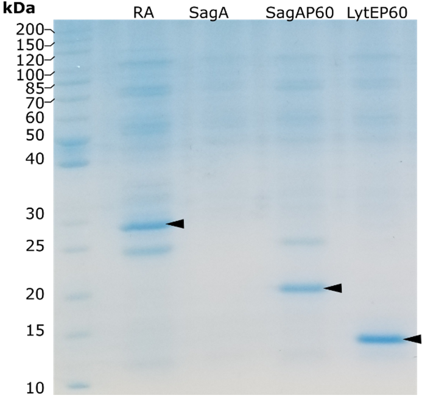
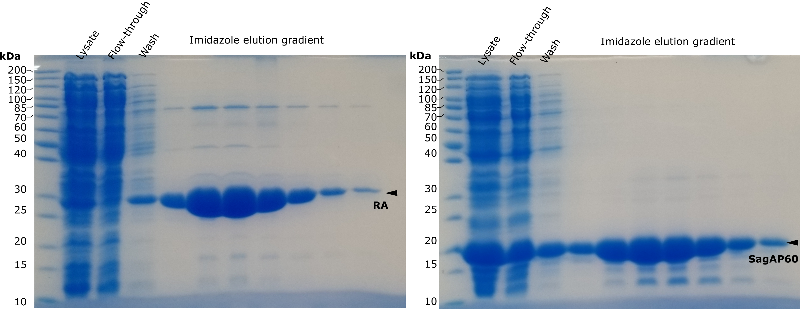
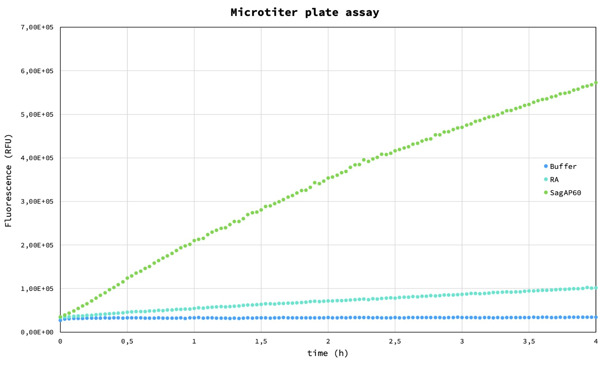
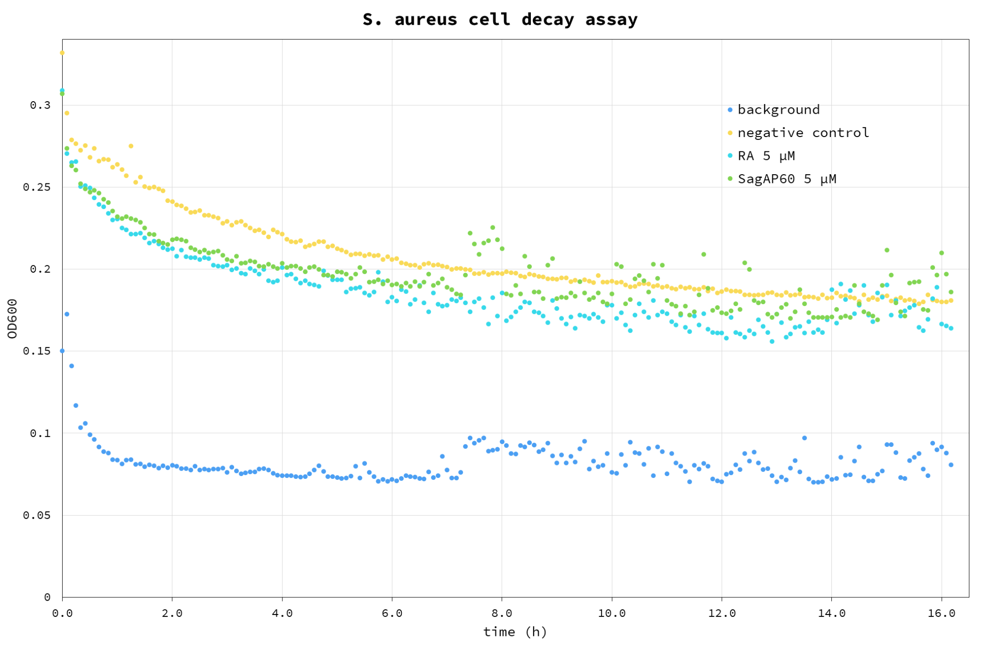
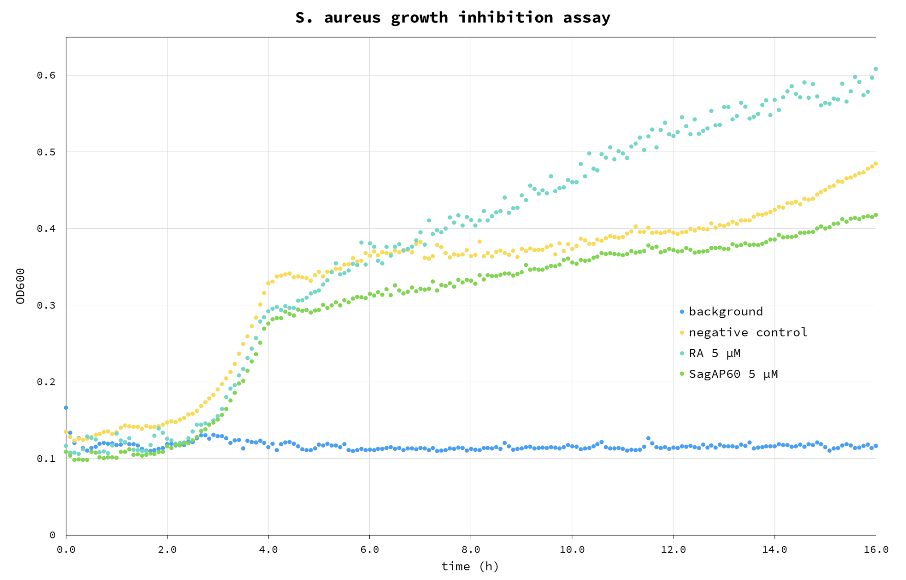

# **Results**

## Cloning and purification

Genes were cloned in pKTCTET-0-Kan vector containing a C-terminal 6His-tag (Obexer et al., 2016). Retro-aldolase 95.2B-3 (RA) was cloned in the same vector as control. Sanger sequencing relvealed that LytE gene underwent a frame-shift mutation, therefore the construct was not used. Genes were expressed in *Escherichia coli*. And purified over a Ni-NTA column. RA, SagAP60 and LytEP60 were purified with acceptable yield, while full length SagA was not recovered in the eluate(Fig 1). Larger amounts of RA and SagAP60 proteins were purified using ÄKTA Avant chromatography system in a second stage (Fig 2).

{ width=300px }

Figure 1. SDS-PAGE analysis of proteins purified using spin-columns. Target proteins are denoted by black arrowheads.

{ width=1000px }
Figure 2. SDS-PAGE analysis of  of proteins purified using chromatographer. Target proteins are denoted by black arrowheads.

## Microtiter plate assay

Purified enzyme fractions have been used to test activity in microtiter plate assay. This proof-of-concept experiment shows that an NlpC/P60 domain can cut synthetic peptide generating fluorescent signal over background. Since starting protein activity is low (after a few hours reaction continues) it is a good starting point to test proposed directed evolution method.

{ width=1000px }
Figure 3. Microtiter plate assay. Blue – buffer, cyan – Retro-aldolase, green – SagAP60.

## Endopeptidase assay in droplets

Following the test in microtiter plate, an experiment to verify functionality of the enzyme assay in droplets was performed: a solution of assay buffer containing the enzyme (Fig 4A) and a control solution of assay buffer without the enzyme (Fig 4B) were encapsulated and the emulsion was imaged after overnight incubation at 37°C. 
To verify the long-term retention of the fluorescent signal in the positive droplets, 10 µL aliquots from both emulsions were mixed and imaged after incubation at 37°C for 2 days (Fig 4C). No appreciable fluorescence exchange between positive and negative droplets was detected.

{ width=1000px }
Figure 4. Assay in droplet. A – positive sample after encapsulation (time 0); B – positive emulsion containing the enzyme (top) next to control emulsion (bottom); C – mixed emulsion of positive and control sample: no leakage is observed after 2 days incubation.

## Live assay on cell suspension

Purified SagAP60 and RA control were used on a suspension of *S. aureus* to test the starting antimicrobial activity. The test was carried out as cell growth assay, by observing the increase of OD600 of cells suspended in LB medium (Fig 5).

{ width=1000px } 
Figure 5. *S. aureus* growth inhibition assay. Blue – background (buffer); Cyan – RA control; Green - SagAP60; Yellow – cell negative control, without any enzyme added.

From the results it appears that the added proteins have a positive effect on growth compared to negative control: we believe this is due to the fact that they were added to the assay as glycerol stocks, providing an additional carbon source we haven’t accounted for, with a 4% glycerol final concentration in the well. For this reason, this test will be repeated using dialysed protein sample.

{ width=1000px } 