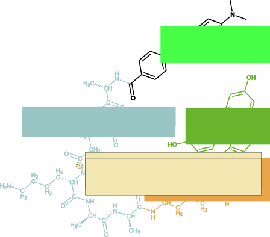

# **Strategy**

## *In-drop* evolution

The aim of our project is to evolve this protein as an effective bacteria-killing agent with the aid of a droplet microfluidics (DµF) platform; this technology allows the generation of large numbers of droplets that each act as single compartments, allowing the screening of large mutant libraries with high frequencies, resulting in a considerable reduction of the time, reaction volumes and the exploration of a larger fraction of the sequence space. This technology has already been successfully applied to evolve enzyme from several classes (Stucki et al., 2021). To this purpose, we developed a microfluidics assay based on a FRET peptide-based molecular beacon mimicking the PG linking peptide of the well-known pathogen *Staphylococcus aureus*.

## The assay

{ width=300px }

{ width=500px }

{ width=1200px }

## Validation

Starting protein and final product of evolution will be then used to perform *in vivo* assays to assess the activity of impairing *Staphylococcus aureus* growth in solution.

{ width=1200px }

