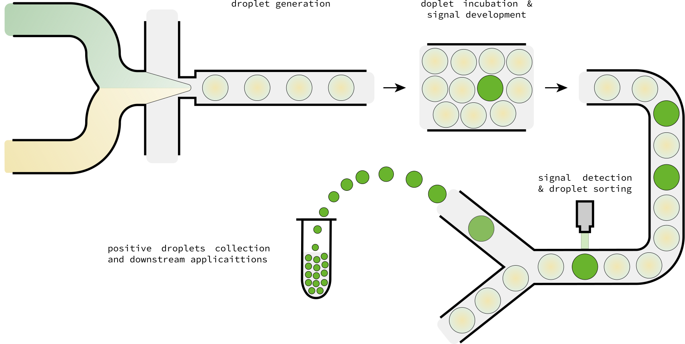
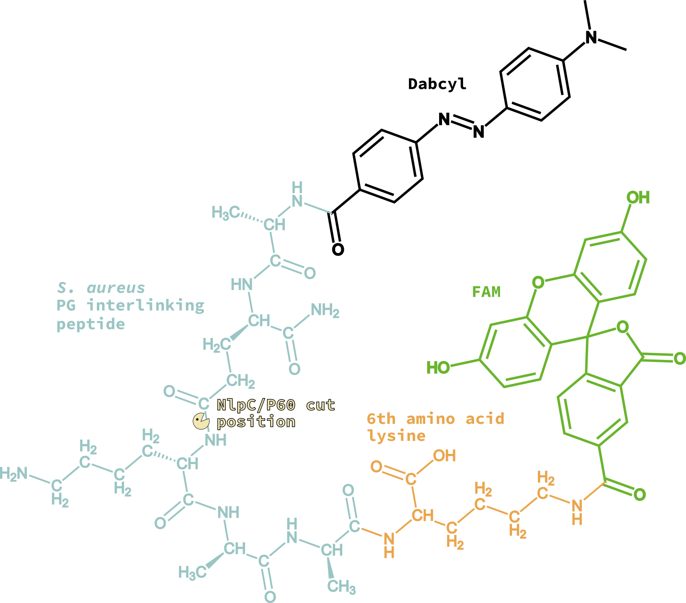
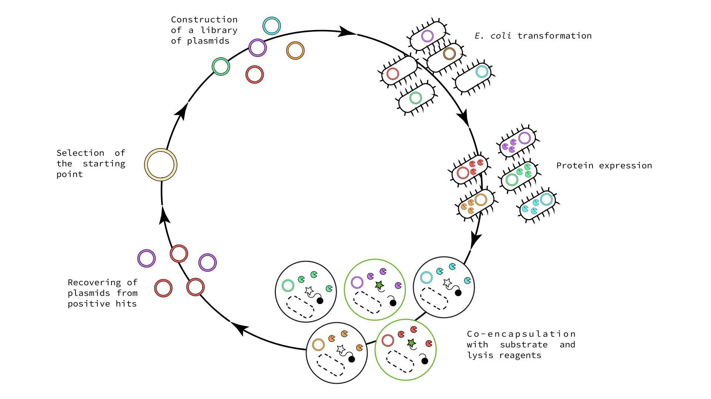

# **Strategy**

## *In-drop* evolution

The aim of our project is to evolve this endolysins as an effective bacteria-killing agent with the aid of a droplet microfluidics (DµF) platform; this technology allows the generation of large numbers of droplets that each act as single compartments, allowing the screening of large mutant libraries at high frequencies, resulting in a considerable reduction of the time, reaction volumes and the exploration of a larger fraction of the sequence space. This technology has already been successfully applied to evolve enzyme from several classes (Stucki et al., 2021). 

{ width=1000px }
Figure 1. Droplets microfluidics principles.
## The assay

To this purpose, we developed a microfluidics assay based on a FRET peptide-based molecular beacon mimicking the PG linking peptide of the well-known pathogen *Staphylococcus aureus*. When such peptide is cut by the enzyme, the fluorophore and quencher parts of the molecule are separated and fluorescence is no no longer quenched, generating fluorescent signal detecable over background.

{ width=400px }

Figure 2. FRET peptide-based molecular beacon will create fluorescent signal after cleavage of peptidic bond. The peptidase is denoted as "Pacman", amino acids in the peptide as blue full circles, fluorophore as star, and quencher as a black full circle.

Since SagA was reported to cleave PG fragments with tetra- and penta-peptides, we selected the pentapeptide as the substrate (Ala-D-isoGln-Lys-D-Ala-D-Ala). For technical reasons related to the laser system installed in the droplet microfluidics station setup, the fluorophore-quencher pair chosen was FAM-Dabcyl. The synthesis of the final beacon peptide required the addition of and Lysine for attaching FAM at C-terminal; therefore, the final sequence of the peptide is (Dabcyl)-Ala-(D-isoGln)-Lys-(D-Ala)-(D-Ala)-Lys-[(N6)-(5-FAM)]. 

{ width=700px }

The mutant library will be created by error-prone PCR, and expressed in *E. coli* BL21. After expression, the library of *E. coli* cells will be and co-encapsulated with the fluorogenic substrate and lytic reagents aiming to encapsulate one cell per droplet; this allows mixing of the cells and the reagents only with the formation of the droplets. After encapsulation, the single cells will undergo lysis within the droplet, releasing the enzyme mutant making it available to cleave the substrate. Mutants with higher activity will lead to droplets with higher fluorescence, allowing sorting of the droplets by signal detection. Plasmids from sorted droplets will be retrieved and sequenced and subjected to other directed evolution cycle.

{ width=1200px }

## Enzyme activity validation

At each evolution round, the parent protein and and the most active variant will be expressed and used to perform *in vivo* assays to assess the activity of impairing *Staphylococcus aureus* growth in solution.

# **References**

Stucki, A., Vallapurackal, J., Ward, T. R. & Dittrich, P. S. Droplet Microfluidics and Directed Evolution of Enzymes: An Intertwined Journey. Angew. Chem. Int. Ed. anie.202016154 (2021) doi:10.1002/anie.202016154.
