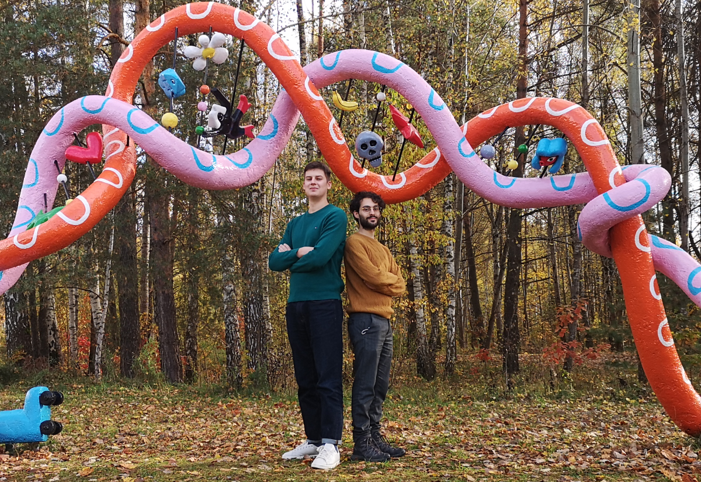

# Our Team

{ width=1200px }

We are Jonas and Lorenzo. Jonas is studying bacteria-phages interactions, focusing on antiviral resistance and Lorenzo is working on enzyme evolution using a high-throughput microfluidic platform. This project combines the best of both worlds: skills in microfluidics and knowledge of microorganisms to develop a new antibacterial agent.